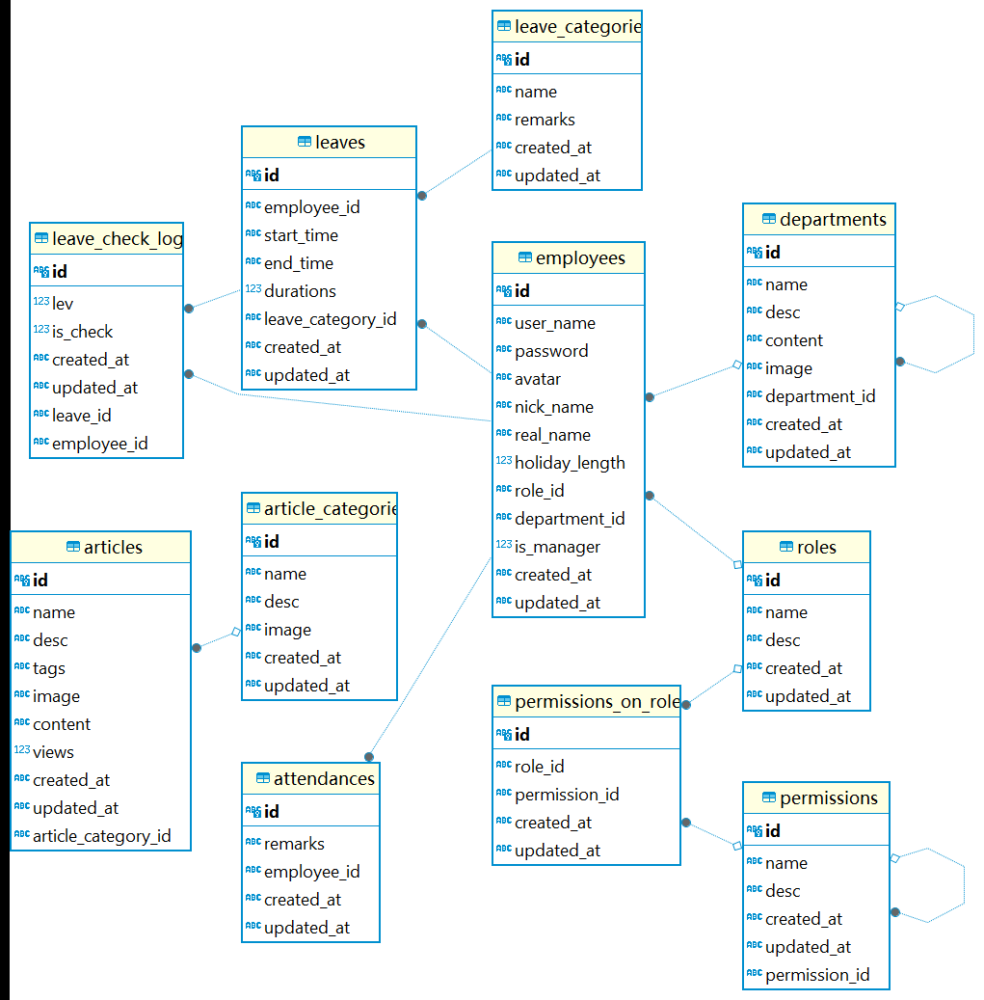
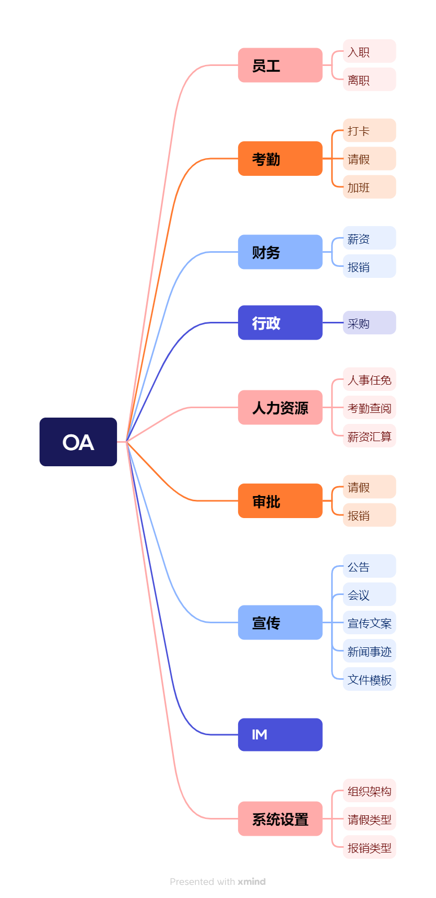

# 简易版OA系统

这是一个简易般的oa系统

## 项目启动

项目使用nest.js框架开发，数据库使用的是sqlite。因为使用了Prisma框架，所以数据库可以根据自己的需要自行进行替换

```bash
pnpm i # 安装依赖
pnpm dlx prisma db push # 创建数据库
npm run start:dev # 启动项目
# 启动之后直接在 http://localhost:3000进行访问
# 接口文档地址为 http://localhost:3000/docs
```

## 数据库ER图



[数据字典](docs/数据字典.xlsx)在docs目录下

## 功能


